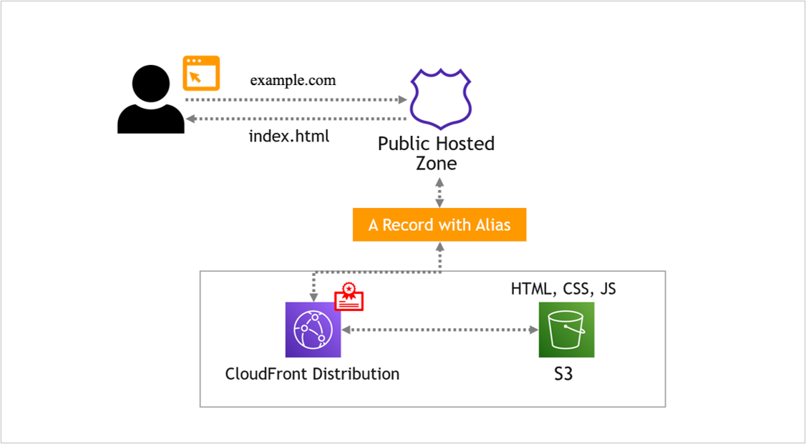

# Résumé using AWS



## Overview

This project involves creating a personal online résumé using AWS services, including S3, Route 53, CloudFront, and ACM (Amazon Certificate Manager). This setup ensures a secure, scalable, and highly available website for showcasing your résumé.

Link : https://resumee.nirmalyax.dev/

project url: https://roadmap.sh/projects/single-page-cv

## Prerequisites

Before starting the project, make sure you have the following:

- An AWS account
- Basic understanding of HTML and web development
- Domain name registered through Route 53 (optional)

## Clone the Repository

To get started, clone this GitHub repository to your local machine:

```bash
git clone https://github.com/nirmalyax/Cloud-Resume-Project.git

cd your-resume-repo
```

## Steps to Replicate

### 1. Create S3 Bucket

- Log in to the AWS Management Console.
- Navigate to the S3 service.
- Create a new S3 bucket with a unique name.
- Copy the bucket policy and change the bucket name accordingly.

```bash
{
  "Version": "2012-10-17",
  "Statement": [
    {
      "Sid": "PublicReadGetObject",
      "Effect": "Allow",
      "Principal": "*",
      "Action": [
        "s3:GetObject"
      ],
      "Resource": [
        "arn:aws:s3:::your-bucket-name/*"
      ]
    }
  ]
}
```

- Upload your résumé HTML file and any other assets to the bucket.

### 2. Configure Route 53 for Custom Domain

- If you have a custom domain registered through Route 53 or another domain registrar, create a new record set in Route 53.
- Choose the type **A Record** and set the alias target to your S3 bucket.
  - If you have a CloudFront distribution, you would set the alias target to the CloudFront distribution instead.
- Save the changes.

### 3. Request and Configure SSL Certificate with ACM

- Navigate to the ACM service in the AWS Management Console.
- Request a new SSL certificate for your domain.
- Validate the certificate using DNS validation.
- Once validated, associate the certificate with your CloudFront distribution.

### 4. Configure CloudFront Distribution

- Navigate to the CloudFront service in the AWS Management Console.
- Create a new CloudFront distribution.
- Set the S3 bucket endpoint as the origin for the distribution.
- Configure default behavior and choose the desired settings.
- Note the CloudFront distribution domain name.

### 5. Test the Online Résumé

- Once the setup is complete, access your résumé using the CloudFront distribution domain or custom domain if configured.
- Verify that the website is accessible securely over HTTPS.

## Additional Considerations

- Implement proper security measures, such as restricting public access to the S3 bucket.
- Optimize your résumé website for performance by leveraging CloudFront caching and compression.
- Regularly update your résumé and upload new versions to the S3 bucket.

## Conclusion

Congratulations! You have successfully deployed your online résumé using AWS services. Feel free to customize and expand the website based on your preferences and requirements.
